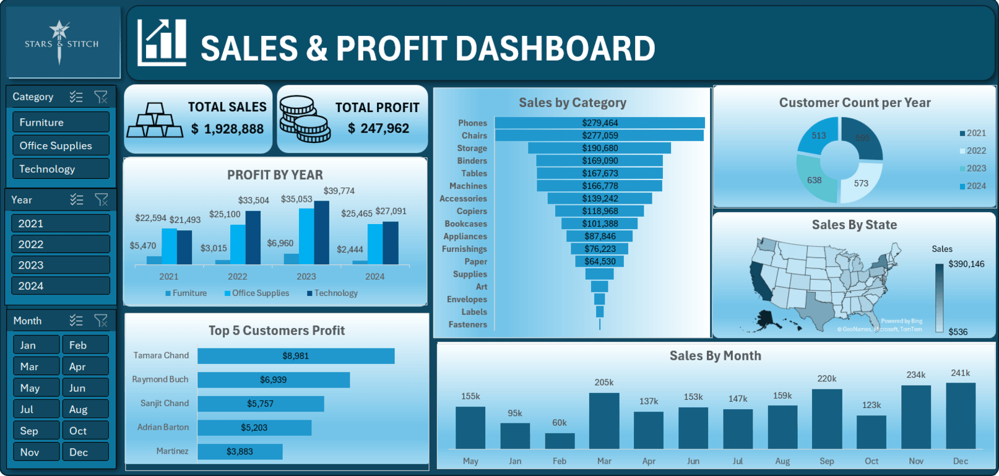

## 📊 Excel Dashboard Preview

📊 Sales & Profit Dashboard – Excel

🔍 Overview
This interactive Sales & Profit Dashboard was built in Microsoft Excel using pivot tables, slicers, and charts. It visualizes multi-year sales performance data to support business decision-making.

💼 Key Features
Total Sales & Profit KPIs for quick performance overview

Profit by Year segmented by product categories

Sales by Category funnel for comparative analysis

Customer Count per Year donut chart

Sales by State via geographic mapping

Top 5 Customers by Profit

Monthly Sales Trends

Interactive filters by Category, Year, and Month

🛠️ Tools Used
Microsoft Excel (Pivot Tables, Slicers, Conditional Formatting, Chart Design)

Data Cleaning and Preprocessing using Excel formulas
